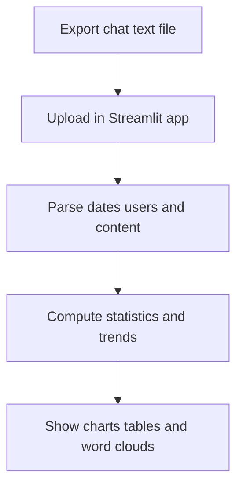
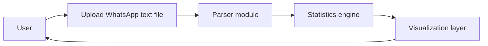

# 📱 WhatsApp Chat Analyzer

WhatsApp Chat Analyzer is a Python and Streamlit based tool for exploring WhatsApp chat exports. It parses the exported text file and turns raw messages into interactive statistics and visualizations. You can use it to understand participation, activity patterns, content trends, and emoji usage in your chats.

## 📖 Introduction

This project helps you turn your WhatsApp conversations into structured insights. After you export a chat from WhatsApp, the app parses each message and aggregates many metrics. It focuses on clarity, interactivity, and ease of use, so non‑technical users can explore results quickly.



## ✨ Features

WhatsApp Chat Analyzer provides several prebuilt analyses and visualizations for your chats.

- 📊 Overall Summary: Total messages, words, media, and links.

- 🏆 User Stats: See the most active participants in the conversation.

- ⏳ Activity Timelines: Daily, weekly, and monthly message trends.

- 🔥 Heatmaps: Activity distribution by weekday and hour of the day.

- ☁️ Word Clouds: Configurable word clouds and frequency tables.

- 😂 Emoji Analysis: Emoji extraction with counts and distribution charts.

- 🔗 Content Detection: Easy identification of shared links and media.

- 🎯 Smart Filters: Analyze individual users or the full group.

- 🌐 Clean UI: Built with Streamlit for a smooth browser experience.

```card
{
  "title": "Output is local only",
  "content": "All analysis runs locally on your machine as long as you host the app yourself."
}
```

## 🛠️ Requirements

You need a working Python environment and a recent WhatsApp chat export file. The application uses Streamlit for the UI and common data science libraries for analysis.

- Python 3.8 or higher.
- pip or another Python package manager.
- A modern web browser for the Streamlit interface.
- The libraries listed in `requirements.txt`, usually including:
  - `streamlit`
  - `pandas`
  - `numpy`
  - `matplotlib`
  - `seaborn`
  - `wordcloud`
  - `emoji`
  - `urlextract`

### 📥 Installing dependencies

You can install all required libraries with a single command.

```bash
pip install -r requirements.txt
```

## ⚙️ Installation

Install the project locally to run the analyzer on your own chats. These steps assume a basic familiarity with the command line.

1. **Clone the repository.**

   ```bash
   git clone https://github.com/RishabhXYZA/WhatsApp-Chat-Analyzer.git
   cd WhatsApp-Chat-Analyzer
   ```

2. **Create a virtual environment.**  
   This step is optional but recommended to isolate dependencies.

   ```bash
   python -m venv .venv
   ```

3. **Activate the virtual environment.**

   - On Linux and macOS:

     ```bash
     source .venv/bin/activate
     ```

   - On Windows:

     ```bash
     .venv\Scripts\activate
     ```

4. **Install Python dependencies.**

   ```bash
   pip install --upgrade pip
   pip install -r requirements.txt
   ```

5. **Verify the installation.**  
   You can run Streamlit’s built in version command to verify the environment.

   ```bash
   streamlit --version
   ```

## 🚀 Usage

You need an exported WhatsApp chat file in text format. Export the chat without media for best performance and cleaner analysis.

1. **Export a chat from WhatsApp.**
   - Open the chat on your phone.
   - Use the menu to export chat as text, usually without media.
   - Transfer the `.txt` file to your computer.

2. **Start the Streamlit app.**  
   Run the application from the project root directory.

   ```bash
   streamlit run app.py
   ```

3. **Open the interface in your browser.**  
   Streamlit usually prints a local URL such as `http://localhost:8501`.

4. **Upload your chat file.**  
   Use the file uploader widget to select the exported `.txt` file.

5. **Choose analysis options.**  
   Select a specific user or keep it on overall analysis. Pick the desired views such as timelines, word cloud, or emojis.

6. **Explore the results.**  
   Scroll through the dashboard and switch between sections using sidebar controls.



## 🔧 Configuration

Most people can use the default settings without any changes. However, you can adjust analysis and visualization behavior if you want more control.

- **Stopwords configuration.**  
  Edit the stopword list to ignore common or irrelevant words in the word cloud and frequency tables.
- **Language and locale handling.**  
  Adjust date and time parsing rules if your export uses a different format or language.
- **Time range filters.**  
  Add sidebar widgets to limit analysis to specific date ranges or periods.
- **Theme or color palette.**  
  Customize colors used in plots and charts within the plotting code.
- **Performance options.**  
  For very large chats, add sampling or caching to improve responsiveness.

### Example customization snippet

You can extend the code to load additional stopwords from a text file.

```python
def load_extra_stopwords(path: str) -> set:
    with open(path, "r", encoding="utf-8") as f:
        return {line.strip().lower() for line in f if line.strip()}

BASE_STOPWORDS = {"the", "and", "is", "are"}
EXTRA_STOPWORDS = load_extra_stopwords("config/extra_stopwords.txt")
ALL_STOPWORDS = BASE_STOPWORDS.union(EXTRA_STOPWORDS)
```

## 🤝 Contributing

Contributions that improve features, performance, or documentation are welcome. Please discuss significant changes in an issue before opening a pull request.

- Fork the repository to your own GitHub account.
- Create a feature branch based on the latest `main` branch.
- Make your changes with clear, small commits.
- Add or update tests when you touch analysis logic.
- Run the app locally and verify that main flows still work.
- Open a pull request and describe your changes and motivation.

```card
{
  "title": "Coding style",
  "content": "Follow PEP 8 guidelines and keep functions small and focused for easier review."
}
```

## 🔧 Technologies Used


## 🔗 Try it LIVE
https://whatsapp-chat-analyzer-4-yrur.onrender.com


## ⚖️ License
This project is licensed under the MIT License. See the LICENSE file for the full legal text. 📝
